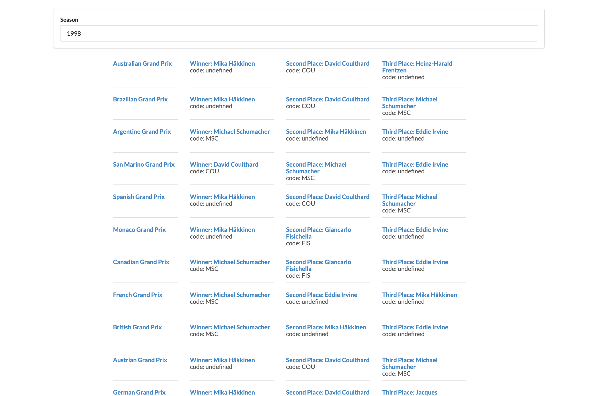

# Formula 1 Results

This app pulls the Formula 1 Results from the 'Ergast' API after the user inputs a year for those results.

## Screenshot

## Built With 🛠

- React
- Ergast API
- VSCode

## Author

### 👨‍💻 Jorge Torres

- Github: [Jorge Torres](https://github.com/Yors-git)
- Linkedin: [Jorge Torres](https://www.linkedin.com/in/jtbribiesca/)
- Twitter: [@Yors_82](https://twitter.com/Yors_82)

### 🤝 Contributing

Contributions, issues and feature requests are welcome!

### Show your support

Give a ⭐️ if you like this project!

### License

This project belongs to Jorge Torres, all rights reserved.